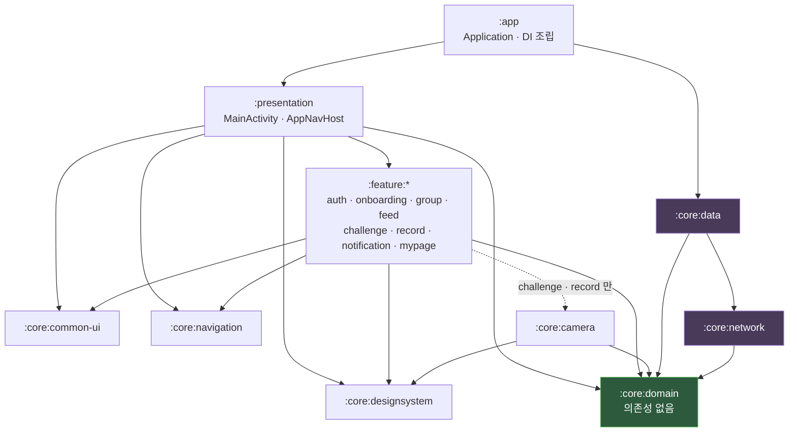

# MODY

친구들과 식사 및 운동을 칼로리 제약 없이 간편하게 기록하고 공유합니다.
’소셜넛지’ 개념을 활용한 소통과 챌린지를 통해 다이어트 습관을 지속하도록 돕습니다.

## Tech Stack

- Kotlin

- Jetpack Compose

- Hilt

- Coroutine / Flow

- Retrofit / OkHttp

- DataStore

## Architecture

MODY Android는 멀티모듈 기반으로 구성되어 있으며, Feature와 Core Layer를 분리하여 유지보수성과 확장성을 높였습니다.

- UI: Jetpack Compose

- Architecture: MVI

- Dependency Injection: Hilt

- Asynchronous: Coroutine / Flow

- Network: Retrofit / OkHttp

- Local Storage: DataStore

- Navigation: Type-safe Navigation + NavigationHelper

## Project Structure

```text

mody

├── app                 # Application, Hilt EntryPoint

├── presentation        # MainActivity, AppNavHost, 앱 진입 및 라우팅

├── core

│   ├── common-ui       # MVI Base(ViewModel, State, Intent, SideEffect)

│   ├── designsystem    # Theme, Typography, Components

│   ├── navigation      # Route, NavigationHelper

│   ├── domain          # Model, Repository, UseCase

│   ├── data            # Repository 구현, DataStore

│   ├── network         # Retrofit, DTO, Interceptor, Authenticator

│   └── camera          # CameraX 촬영/크롭 오버레이, EXIF 정규화

└── feature

    ├── auth

    ├── onboarding

    ├── group

    ├── feed

    ├── challenge

    ├── record

    ├── notification

    └── mypage

```

## Dependency Graph



### 의존성 규칙

의존성 방향을 문서나 코드리뷰가 아니라 **Gradle 모듈 경계로 강제**합니다.

| 규칙 | 강제 방식 |
| --- | --- |
| `:core:domain` 은 아무것도 의존하지 않는다 | 순수 Kotlin 계약 계층 (Android SDK·Retrofit 미참조) |
| `:feature:*` 는 `:core:data` / `:core:network` 를 모른다 | 의존성에 선언하지 않음 → DTO·Retrofit API 참조 시 **컴파일 실패** |
| `:feature:*` 끼리 서로 의존하지 않는다 | 화면 이동은 `:core:navigation` 의 Route + `NavigationHelper` 경유 |
| 구현체 주입은 `:app` 한 곳에서만 | `:core:data` 를 의존하는 유일한 모듈 |

공유가 발생하는 순간 `core` 로 승격합니다. `:core:camera` 는 `:feature:challenge` 와
`:feature:record` 가 함께 쓰게 되면서, feature 간 의존을 만들지 않기 위해 분리한 모듈입니다.

> 현재 Feature 모듈을 지속적으로 분리 및 확장하며 아키텍처를 개선하고 있습니다.
