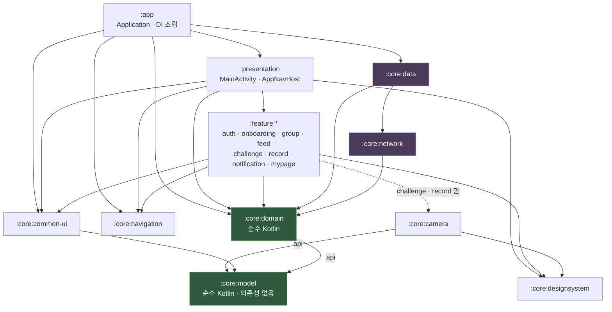

# MODY

친구들과 식사 및 운동을 칼로리 제약 없이 간편하게 기록하고 공유합니다.
’소셜넛지’ 개념을 활용한 소통과 챌린지를 통해 다이어트 습관을 지속하도록 돕습니다.

## Tech Stack

| 분류 | 사용 기술 |
| --- | --- |
| Language | Kotlin |
| UI | Jetpack Compose, Coil, Lottie |
| Architecture | Clean Architecture + MVI, 멀티모듈 |
| DI | Hilt |
| Async | Coroutine / Flow |
| Network | Retrofit, OkHttp |
| Local | DataStore, EncryptedSharedPreferences(토큰) |
| Navigation | Type-safe Navigation + NavigationHelper |
| Auth | Kakao SDK, Google Sign-In |
| Camera | CameraX (촬영·크롭·EXIF 정규화) |
| Health | Health Connect (걸음 수 읽기) |
| Firebase | Cloud Messaging, Crashlytics, Analytics, Remote Config |
| Test | JUnit (순수 로직 단위 테스트), Konsist (아키텍처 규칙 검증) |

## Architecture

MODY Android는 멀티모듈 기반으로 구성되어 있으며, Feature와 Core Layer를 분리하여 유지보수성과 확장성을 높였습니다.

화면은 단방향으로 흐릅니다. 사용자 액션은 `Intent` 로만 ViewModel 에 들어가고, 상태 변경은
`setState { copy(...) }` 한 곳으로 모입니다. `Screen` 은 렌더링만 맡아 비즈니스 로직·화면 이동을
직접 다루지 않습니다.

```text
Screen ──onIntent(Intent)──> ViewModel ──> Repository(:core:domain 인터페이스)
   ^                             │
   └────── StateFlow<State> ─────┘
```

## Project Structure

```text

mody

├── app                 # Application, Hilt EntryPoint

├── presentation        # MainActivity, AppNavHost, 앱 진입 및 라우팅

├── core

│   ├── common-ui       # MVI Base(BaseViewModel, UiState, UiIntent)

│   ├── designsystem    # Theme, Typography, Components

│   ├── navigation      # Route, NavigationHelper

│   ├── model           # 값 타입(순수 Kotlin, 의존성 없음)

│   ├── domain          # Repository 인터페이스, UseCase (순수 Kotlin)

│   ├── data            # Repository 구현, DataStore

│   ├── network         # Retrofit, DTO, Interceptor, Authenticator

│   └── camera          # CameraX 촬영/크롭 오버레이, EXIF 정규화

└── feature

    ├── auth

    ├── onboarding

    ├── group

    ├── feed

    ├── challenge

    ├── record

    ├── notification

    └── mypage

```

## Dependency Graph



화살표는 기본이 `implementation` 입니다. `api` 로 표시한 곳은 공개 시그니처에 그 모듈의
타입이 드러나 소비자에게 전이되는 의존성입니다.

### 의존성 규칙

의존성 방향을 문서나 코드리뷰가 아니라 **Gradle 모듈 경계로 강제**합니다.

| 규칙 | 강제 방식 |
| --- | --- |
| `:core:model` 은 아무것도 의존하지 않는다 | 순수 Kotlin JVM 모듈 — Android SDK 가 클래스패스에 없다 |
| `:core:domain` 은 `:core:model` 만 의존한다 | 마찬가지로 순수 Kotlin JVM — 프레임워크 타입을 쓰면 **컴파일 실패** |
| `:feature:*` 는 `:core:data` / `:core:network` 를 모른다 | 의존성에 선언하지 않음 → DTO·Retrofit API 참조 시 **컴파일 실패** |
| `:feature:*` 끼리 서로 의존하지 않는다 | 화면 이동은 `:core:navigation` 의 Route + `NavigationHelper` 경유 |
| 구현체 주입은 `:app` 한 곳에서만 | `:core:data` 를 의존하는 유일한 모듈 |
| 공개 시그니처에 드러나는 의존성만 `api` | 나머지는 `implementation` 으로 전이 차단 → 소비자가 남의 내부 타입에 기대지 못함 |

공유가 발생하는 순간 `core` 로 승격합니다. `:core:camera` 는 `:feature:challenge` 와
`:feature:record` 가 함께 쓰게 되면서, feature 간 의존을 만들지 않기 위해 분리한 모듈입니다.

승격한 모듈은 **공개 표면을 최소로 유지**합니다. `:core:camera` 가 밖으로 여는 것은
오버레이 진입점 `ModyCameraOverlay` 와 프레임 비율 상수뿐이고, 촬영·보정 단계와 파일
정리 함수는 `internal` 입니다. 단계를 건너뛴 반쪽 호출이나 외부에서의 캐시 삭제를
컴파일 단계에서 막습니다.

반대로 **필요 이상으로 끌어오는 것도 막습니다.** 값 타입만 쓰는 모듈이 Repository
인터페이스와 UseCase 까지 컴파일 클래스패스에 얹지 않도록 `:core:model` 을 따로 뒀습니다.
`:core:camera` 는 `CropRegion` 하나, `:core:common-ui` 는 `HealthAvailability` 하나만
쓰므로 `:core:domain` 을 보지 않습니다.

두 모듈은 안드로이드 라이브러리가 아니라 **순수 Kotlin JVM 모듈**입니다. Android SDK 가
클래스패스에 아예 없어서 프레임워크 타입을 쓰려 해도 컴파일이 되지 않습니다 — 규칙을
테스트가 아니라 빌드가 강제합니다.

### 모듈 경계가 못 잡는 것은 테스트로 잡습니다

Gradle 은 **모듈 사이**만 막습니다. 같은 모듈 안에서 State 에 `var` 를 넣거나 Screen 이
NavController 를 직접 만지는 것은 컴파일이 통과하므로, [Konsist](https://docs.konsist.lemonappdev.com/)
로 검사해 CI 에서 실패시킵니다 (`app/src/test/.../ArchitectureRuleTest.kt`, 10개 규칙).

```kotlin
@Test
fun `State 에 var 프로퍼티가 없다`() { /* ... */ }

@Test
fun `Screen 은 NavController 를 직접 다루지 않는다`() { /* ... */ }
```

| 검사 대상 | 규칙 |
| --- | --- |
| State / Intent | State 는 `data class : UiState`, Intent 는 `sealed : UiIntent`, State 에 `var` 금지 |
| ViewModel | `BaseViewModel` 상속, `@HiltViewModel` 주입 |
| Screen | `NavController` 직접 조작 금지, Repository 직접 참조 금지 |
| 레이어 | feature·presentation 이 data/network 구현체 미참조, domain 이 Android 프레임워크 미의존 |
| 네이밍 | Repository 구현체는 `Impl` 로 끝나고 `@Singleton` |

```bash
./gradlew :app:testDebugUnitTest   # 아키텍처 규칙 검사 포함
```

### 계산이 들어간 로직은 단위 테스트로 고정합니다

UI·네트워크에 묶이지 않는 계산은 순수 함수로 빼서 JVM 테스트로 덮습니다. 좌표·시간·경계값은
기기에서 눈으로 확인하기 어려운 대신 테스트로는 싸게 잡힙니다 (36개).

| 대상 | 무엇을 고정하나 |
| --- | --- |
| `:core:camera` `CropGeometryTest` | 크롭 프레임 위치, 드래그 경계 클램프, 세로 슬라이스 크롭 영역 |
| `:core:domain` `StepSyncWindowTest` | 걸음 수 동기화 구간 분할 — 날짜 경계, 자정 처리, 읽기 창 초과 |
| `:core:model` `StepChallengeStatusTest` | 챌린지 상태 매핑, 달성률 내림·상한·0 나눗셈 |
| `:feature:challenge` `StepChallengeTitleTest` | 챌린지 제목 파싱의 비정상 입력 처리 |

> 현재 Feature 모듈을 지속적으로 분리 및 확장하며 아키텍처를 개선하고 있습니다.

## Build & Run

```bash
./gradlew assembleDebug     # debug 빌드
./gradlew installDebug      # 기기에 설치
./gradlew test              # unit test (아키텍처 규칙 검사 포함)
./gradlew lint              # lint
```

| buildType | applicationId | 용도 |
| --- | --- | --- |
| debug | `com.makeus.mody.dev` | 개발 — release 와 동시 설치 가능 |
| release | `com.makeus.mody` | 배포 |

카카오 네이티브 키는 `local.properties` 에서 읽습니다(미설정 시 빈 값으로 빌드되며 카카오
로그인·공유가 동작하지 않습니다).

```properties
KAKAO_NATIVE_KEY_DEV=...
KAKAO_NATIVE_KEY_PROD=...
```
